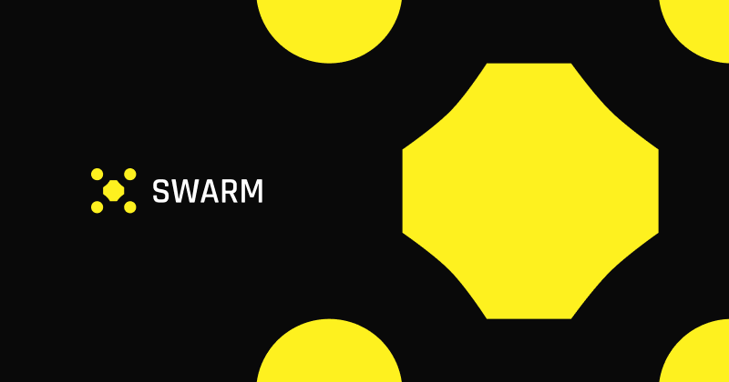
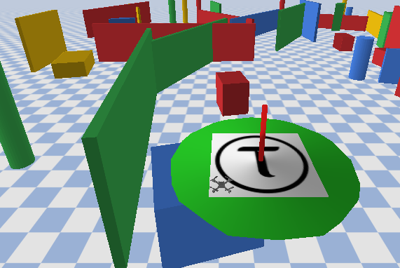

<div align="center">
  <h1>🐝 <strong>Swarm</strong> – Bittensor Drone autopilot Subnet 🐝</h1>
  
  <p>
    <a href="docs/miner.md">🚀 Miner guide</a> &bull;
    <a href="docs/validator.md">🔐 Validator guide</a> &bull;
    <a href="docs/roadmap.md">🔐 Roadmap</a> &bull;
    <a href="https://x.com/SwarmSubnet">🐦 Follow us on X</a> &bull;
    <a href="https://discord.com/channels/799672011265015819/1385341501130801172">💬 Join us on Discord</a>
  </p>
</div>

## 🔍 Overview
Swarm is a **Bittensor subnet engineered to enable decentralized autonomous drone flight**.

Validators create synthetic "map tasks" and evaluate miner‑supplied **pre‑trained RL policies** inside a PyBullet physics simulator.  

Miners that produce fast and *successful* policies earn the highest rewards

**Why OS drone flying?**

- Open-sourcing flight algorithms isn't just idealism – it is a practical route to safer, cheaper and more accountable drones, and it prevents the future of aerial autonomy from being locked behind half a dozen NDAs

- Our ambition is to establish Swarm miners as the **go‑to control intelligence for micro‑drone navigation** in research and industry.

---
## ⚙️ Subnet Mechanics

### 🧑‍🏫 Validator

- Generates unique MapTasks  
- Evaluates policies head‑less and validates them
- Assigns weights proportional to the final reward score

### ⛏️ Miner

- Provides pre‑trained RL policies that are evaluated on secret tasks.  
- Any framework is allowed – Stable Baselines 3, custom PyTorch, etc.  
- Must export models in compatible format for validator evaluation.

---

## Swarm Core components

| Component             | Purpose                           | Key points (code refs)                                                      |
|-----------------------|-----------------------------------|------------------------------------------------------------------------------|
| **MapTask**           | Internal validator task         | Random start→goal pair, simulation time‑step `sim_dt`, hard time limit `horizon` (`swarm.protocol.MapTask`) |
| **PolicyRef**         | Model metadata                    | SHA256, framework, size (`swarm.protocol.PolicyRef`) |
| **Policy Evaluation** | RL model testing                 | Loads and runs policy on secret tasks (`swarm.validator.forward`) |
| **Reward**            | Maps outcome → [0,1] score        | 0.50 × success + 0.50 × time (`swarm.validator.reward.flight_reward`) |

### Task generation

*Radial* goals 10–30 m away are sampled at random altitude; every mission is uniquely seeded and fully reproducible.

```python
# swarm/validator/task_gen.py
goal = rng.uniform(R_MIN, R_MAX)   # 10 m ≤ r ≤ 30 m
```

### Validation loop  
The validator:

1. Evaluates the provided policy
2. Tracks distance‑to‑goal and hover duration
3. Scores the run and writes the weight to the chain

Here is an example image of our GUI!

<div align="center">

</div>

---

## 🎯 Incentive model

| Term        | Weight | Rationale                               |
|-------------|--------|-----------------------------------------|
| Success     | 0.50   | Reached + 5 s hover; safety first       |
| Time        | 0.50   | 1 − t / horizon; encourages speed       |

---

## 🤝 Contributing
PRs, issues and benchmark ideas are welcome!  

---

## 📜 License
Licensed under the MIT License – see LICENSE.

Built with ❤️ by the Swarm team.