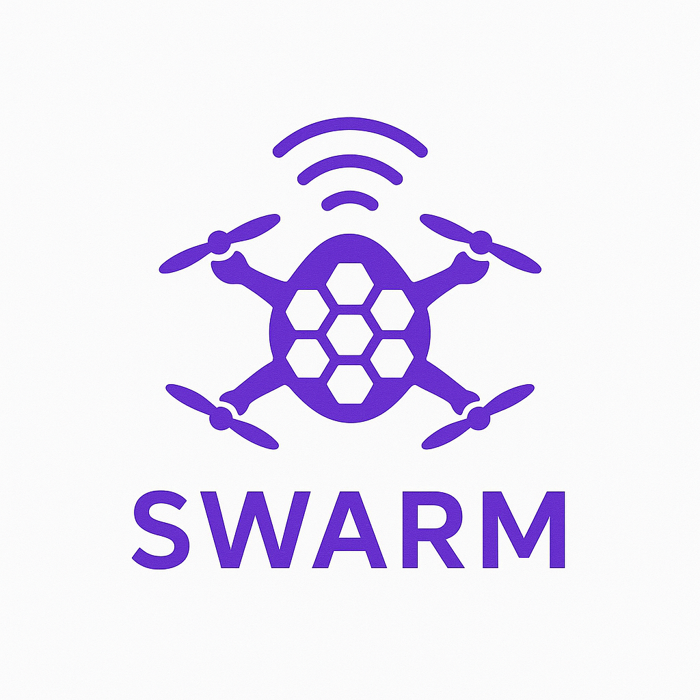

<div align="center">
  <h1>🐝 <strong>Swarm</strong> – Bittensor Drone autopilot Subnet</h1>
  
  <p>
    <a href="docs/miner.md">🚀 Miner guide</a> &bull;
    <a href="docs/validator.md">🔐 Validator guide</a> &bull;
    <a href="docs/roadmap.md">🔐 Roadmap</a>
    <a href="https://discord.com/channels/799672011265015819/1385341501130801172">💬 Join us on Discord</a>
  </p>
</div>
---

## 🔍 Overview
Swarm is a **Bittensor subnet purpose‑built for autonomous quad‑rotor flight**.  
Validators create synthetic “map tasks” and replay miner‑supplied **open‑loop rotor‑RPM schedules** inside a PyBullet physics simulator.  
Miners that produce fast, energy‑efficient and *successful* flight plans earn the highest rewards

**Why OS drone flying?**

- Open-sourcing flight algorithms isn’t just idealism – it is a practical route to safer, cheaper and more accountable drones, and it prevents the future of aerial autonomy from being locked behind half a dozen NDAs

Our ambition is to establish Swarm miners as the **go‑to control brains for micro‑drone navigation** in research and industry.

---

## Swarm Flight

| Component             | Purpose                           | Key points (code refs)                                                      |
|-----------------------|-----------------------------------|------------------------------------------------------------------------------|
| **MapTask**           | Validator → Miner mission         | Random start→goal pair, simulation time‑step `sim_dt`, hard time limit `horizon` (`swarm.protocol.MapTask`) |
| **Miner “FlightPlan”**| Open‑loop list of (t, rpm₁…₄)     | Set of instructions that will be replayed by the validator |
| **Replay Engine**     | Deterministic PyBullet re‑execution | Converts ragged command list into step‑indexed RPM table, tracks energy (`swarm.validator.replay`) |
| **Reward**            | Maps outcome → [0,1] score        | 0.70 × success + 0.15 × time + 0.15 × energy (`swarm.validator.reward.flight_reward`) |

### Task generation

*Radial* goals 10–30 m away are sampled at random altitude; every mission is uniquely seeded and fully reproducible.

```python
# swarm/validator/task_gen.py
goal = rng.uniform(R_MIN, R_MAX)   # 10 m ≤ r ≤ 30 m
```

**Validation loop**  
The validator:

1. Replays the provided FlightPlan at fixed `sim_dt`.
2. Tracks distance‑to‑goal, hover duration and integrated energy.
3. Scores the run and writes the weight to chain.

All physics, rendering and PID controllers live in an isolated subprocess to guarantee determinism and sandboxing.

---

## ⚙️ Subnet Mechanics

### 🧑‍🏫 Validator

- Generates unique MapTasks per  
- Replays plans head‑less, or with an optional GUI for debugging (`--gui`).  
- Assigns weights proportional to the final reward score.

### ⛏️ Miner

- Receives the MapTask and must output a FlightPlan before timeout.  
- Any strategy is allowed – classical control, RL, planning, imitation …  
- Must respect the `sim_dt` sampling time; extra points for finish < `horizon` and low energy.

Reference Strategy: A trivial three‑way‑point PID controller is bundled in `swarm.core.flying_strategy`.  
It reaches the goal some percentage of the time. Be aware, the challenges will get harder!

---

## 🎯 Incentive model

| Term        | Weight | Rationale                               |
|-------------|--------|-----------------------------------------|
| Success     | 0.70   | Reached + 5 s hover; safety first       |
| Time        | 0.15   | 1 − t / horizon; encourages speed       |
| Energy      | 0.15   | 1 − e / e_budget; rewards efficiency    |

---

## 🤝 Contributing
PRs, issues and benchmark ideas are welcome!  

---

## 📜 License
Licensed under the MIT License – see LICENSE.

Built with ❤️ by the Swarm team.
