<div align="center">
  <h1>🐝 <strong>Swarm</strong> – Bittensor Drone Autopilot Subnet 🐝</h1>
  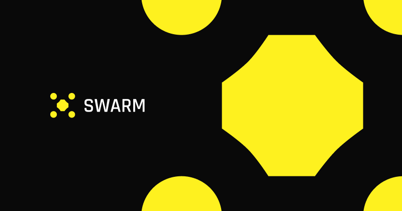
  <p>
    <a href="docs/miner.md">🚀 Miner Guide</a> &bull;
    <a href="docs/validator.md">🔐 Validator Guide</a> &bull;
    <a href="docs/roadmap.md">🗺️ Roadmap</a> &bull;
    <a href="https://x.com/SwarmSubnet">🐦 Follow us on X</a> &bull;
    <a href="https://swarm124.com/">🌐 Web & Leaderboard</a>
    <br>
    <a href="https://discord.com/channels/799672011265015819/1385341501130801172">💬 Join us on Discord</a>
  </p>
</div>

## Overview

Swarm is a **Bittensor subnet** for autonomous drone navigation. Miners train RL policies that are benchmarked across procedurally generated 3D environments — navigating cities, mountains, warehouses, forests, and open terrain.

The top-performing model earns the subnet rewards and is **published on our [website](https://swarm124.com/)** — available for other miners to download, build on top of, or improve. Every champion raises the bar for the next one.

---

## 🗺️ Maps

Every benchmark seed produces a unique environment. Five map types test different navigation skills — from obstacle-free flight to dense indoor navigation.

### City (40% of seeds)

Procedural OBJ-mesh city with roads, intersections, streetlights, and trees. Four sub-variants scale from low-density residential neighborhoods to maximum-density urban cores with skyscrapers.

<table>
  <tr>
    <td align="center">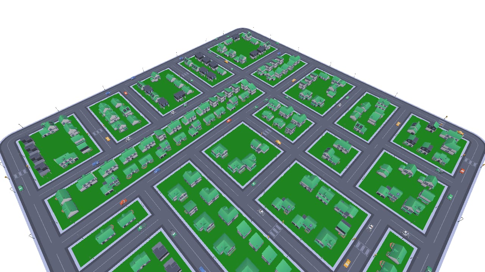<br><b>Residential</b></td>
    <td align="center">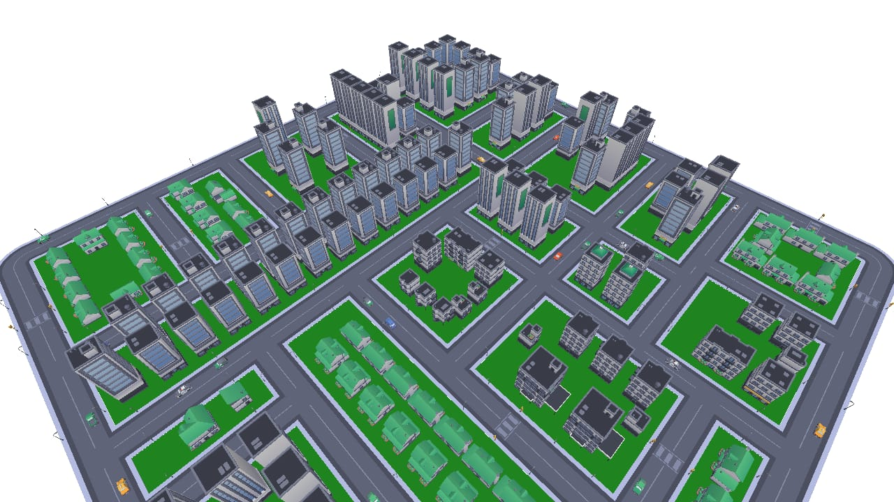<br><b>Mixed</b></td>
  </tr>
  <tr>
    <td align="center">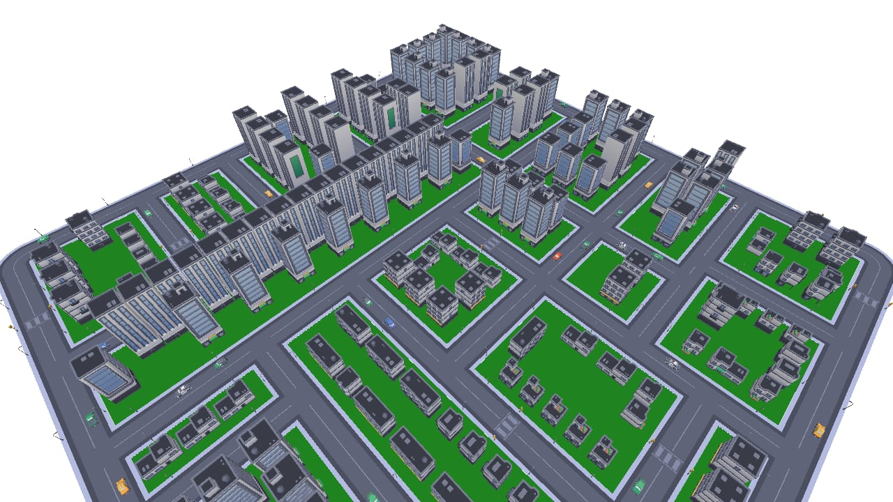<br><b>Urban</b></td>
    <td align="center">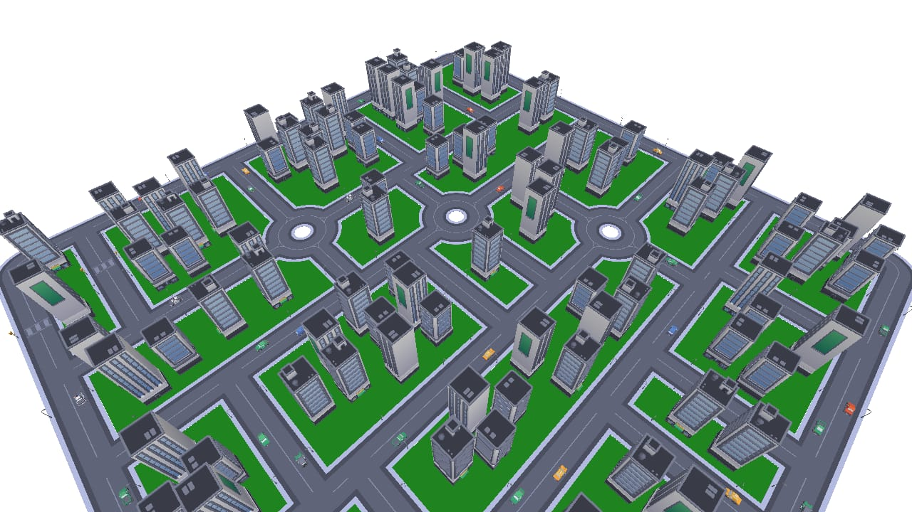<br><b>Hard Mode</b></td>
  </tr>
</table>

### Open (15% of seeds)

No obstacles. Tests raw navigation, altitude control, and precision landing.

<div align="center">
  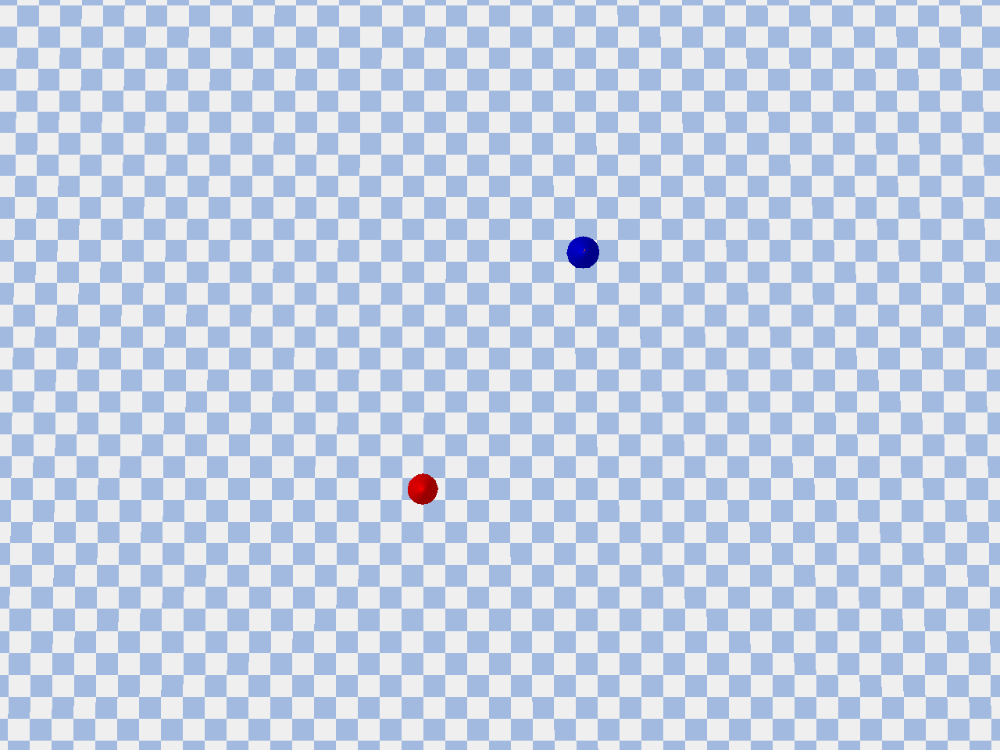
</div>

### Mountain (25% of seeds)

Two subtypes: procedural snow terrain with scattered peaks and valleys, or a ski village with road grids, snow-roofed buildings, and surrounding mountain ranges.

<table>
  <tr>
    <td align="center">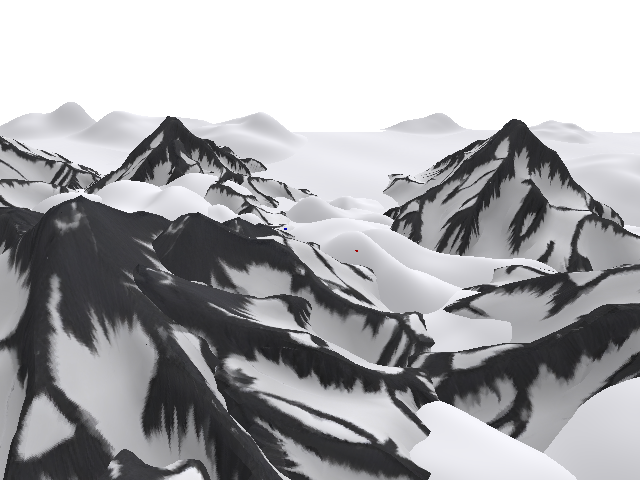<br><b>Mountains Only</b></td>
    <td align="center">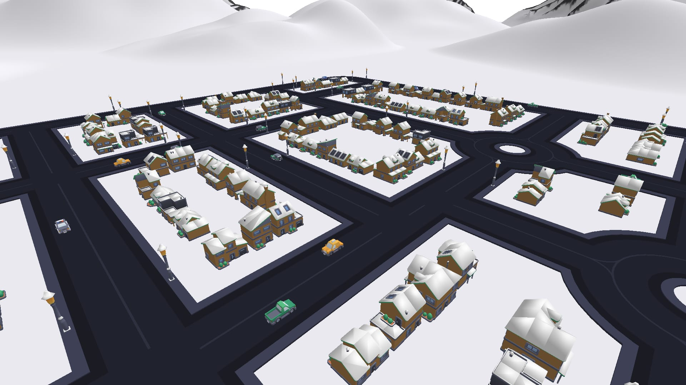<br><b>Ski Village</b></td>
  </tr>
</table>

### Warehouse (20% of seeds)

Indoor 80m × 50m warehouse with storage racks, forklifts, loading docks, conveyors, overhead cranes, an embedded office, factory equipment, and a full roof/truss structure. Start and goal platforms are placed collision-free with a minimum 10m separation.

<div align="center">
  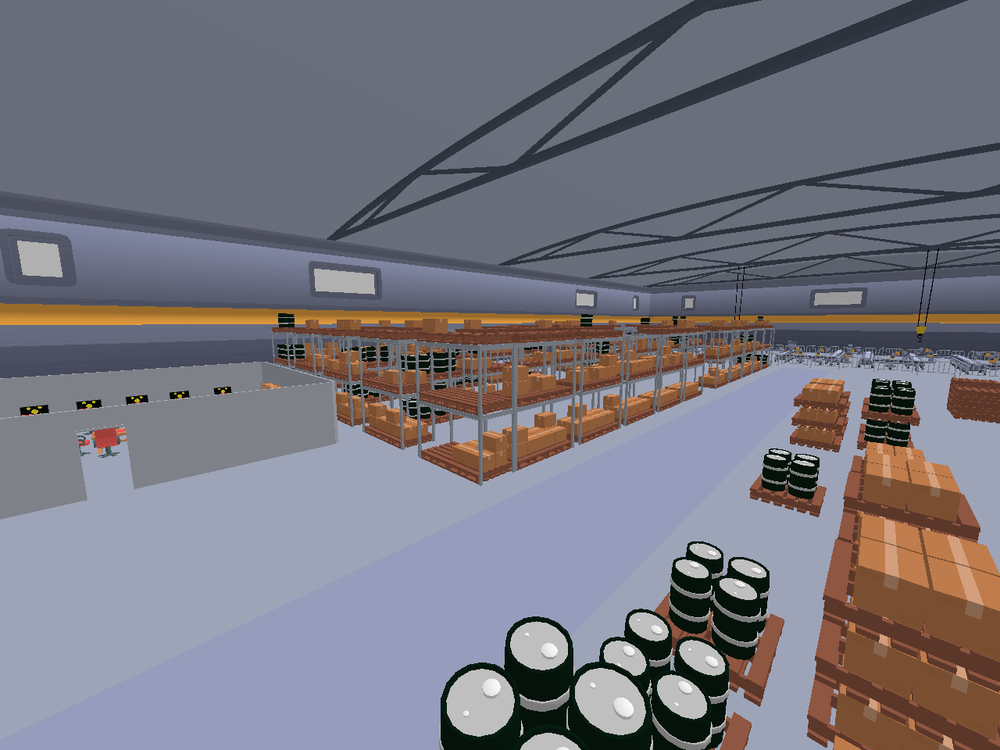<br>
</div>

<table>
  <tr>
    <td align="center">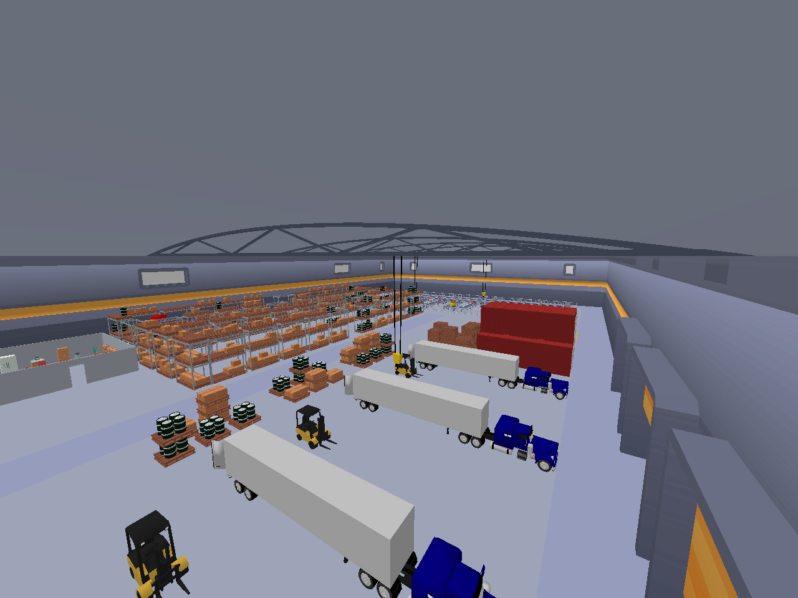<br><b>Loading Docks & Storage</b></td>
    <td align="center">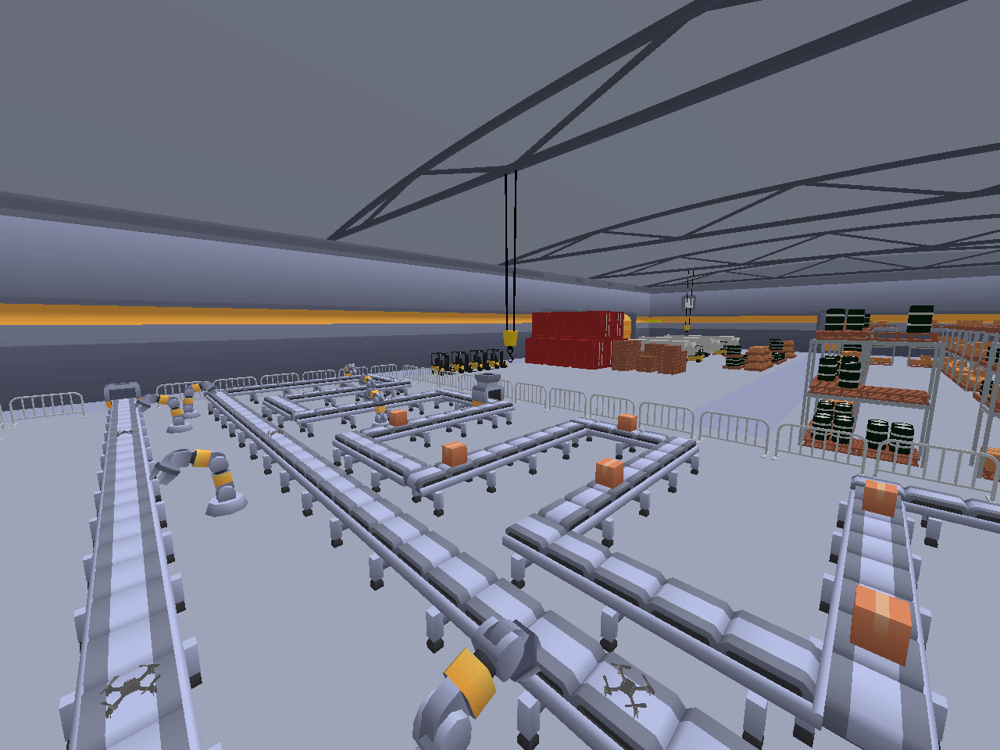<br><b>Factory & Overhead Cranes</b></td>
  </tr>
</table>

### Forest (Coming Soon)

Dense forest environment with trees, vegetation, and uneven terrain. Designed to test low-altitude navigation through natural obstacles.

### Moving Platform

On City, Open, and Mountain maps, the goal platform may move in **circular**, **linear**, or **figure-8** patterns. The drone must track and reach the moving target.

---

## ⚙️ Benchmark System

### Epoch-Based Seed Rotation

Benchmark seeds rotate every **7 days**. Each epoch, every validator independently generates 1,000 cryptographically random seeds — with this sample size the statistical variance across validators is negligible.

```
Epoch starts (every Monday 16:00 UTC)
  │
  ├── Each validator generates 1,000 random seeds (random.SystemRandom)
  ├── All models evaluated on those seeds (fair comparison)
  │
Epoch ends (7 days later)
  │
  ├── Per-validator seeds published on our website (full transparency)
  ├── Champion re-evaluated on new epoch seeds
  │     └── Score updated — champion keeps title with the new score
  └── Old cache cleaned up, new worlds prebuilt
```

### Evaluation Pipeline

1. **Miner** submits an RPC agent (`drone_agent.py` + trained model)
2. **Validator** downloads the agent and runs it in a sandboxed Docker container:
   - **Screening** (200 seeds) — quick filter for low-quality models
   - **Full benchmark** (800 seeds) — scored across all five map types
3. **Final score** = median of all 1,000 seed results
4. **Backend** aggregates scores from multiple validators (51% stake consensus)
5. **Winner-take-all** — #1 scorer receives emissions

Models are identified by SHA-256 hash — same model is never re-evaluated within the same epoch.

---

## 🎯 Scoring

```
score = 0.45 × success + 0.45 × time + 0.10 × safety
```

| Term | Weight | Description |
|------|--------|-------------|
| **Success** | 0.45 | 1.0 if the drone achieves a valid landing, 0.0 otherwise |
| **Time** | 0.45 | 1.0 if within target time, decays linearly to 0.0 at horizon |
| **Safety** | 0.10 | Based on minimum clearance from obstacles during flight |

### Landing

For **static platforms**, touching is not enough — the drone must hold a **stable landing** for 0.5 seconds:

| Condition | Threshold |
|-----------|-----------|
| Vertical velocity | ≤ 0.5 m/s |
| Horizontal velocity | ≤ 0.6 m/s (relative to platform) |
| Tilt (roll / pitch) | ≤ 15° |

For **moving platforms**, contact with the platform is enough to count as success.

Collision with any obstacle sets the score to **0.01**.

### Safety

Throughout the entire flight, the simulator tracks the **minimum distance** between the drone and any obstacle. This worst-case clearance determines the safety score:

| Minimum Clearance | Safety Score |
|-------------------|-------------|
| ≥ 1.0m | 1.0 (full) |
| ≤ 0.2m | 0.0 (none) |
| Between 0.2m – 1.0m | Linear interpolation |

A drone that completes the mission but flies 0.1m from a wall gets zero safety score. A drone that keeps 1m+ clearance at all times gets the full 10%.

This pushes models to fly safely and predictably — the kind of behavior you actually want from a real drone.

---

## 🔍 Observations

Miners receive depth and state observations.

| Field | Shape | Description |
|-------|-------|-------------|
| `depth` | (128, 128, 1) | Normalized depth map (0.5m – 20m range) |
| `state` | (N,) | Position, velocity, orientation, action history, altitude, search area direction |

The search area gives a direction toward the goal with up to ±10m noise — sometimes close, sometimes off. The drone must use its depth sensor to find the actual landing platform.

---

## 🚀 Getting Started

| Role | Guide |
|------|-------|
| **Miner** | [Miner Guide](docs/miner.md) — submission format, local testing, deployment |
| **Validator** | [Validator Guide](docs/validator.md) — installation, Docker setup, operation |

---

## 🤝 Contributing

PRs, issues, and benchmark ideas are welcome.

---

## 📜 License

Licensed under the MIT License — see [LICENSE](LICENSE).

Built with ❤️ by the Swarm team.
